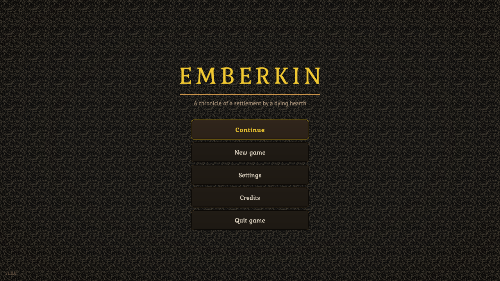
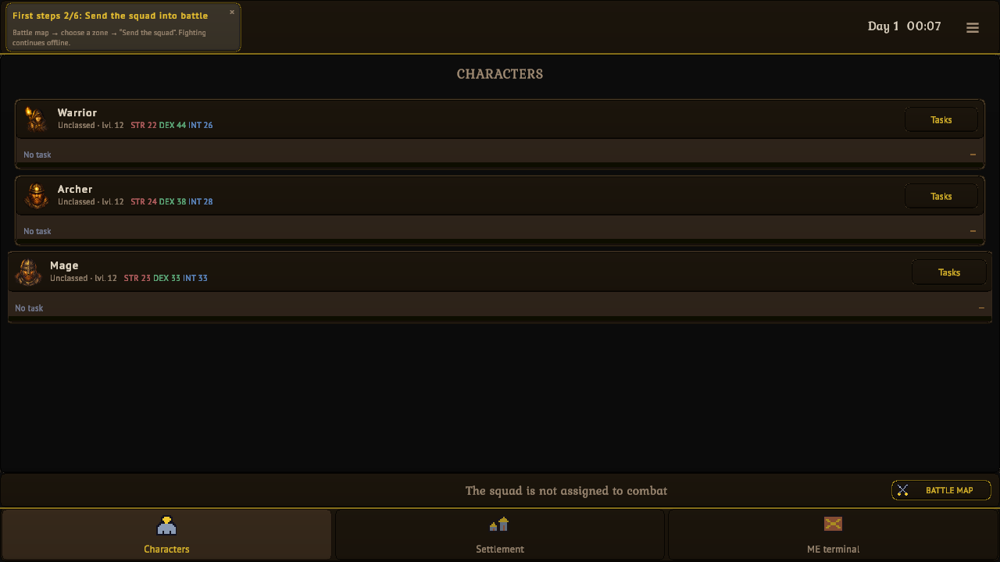
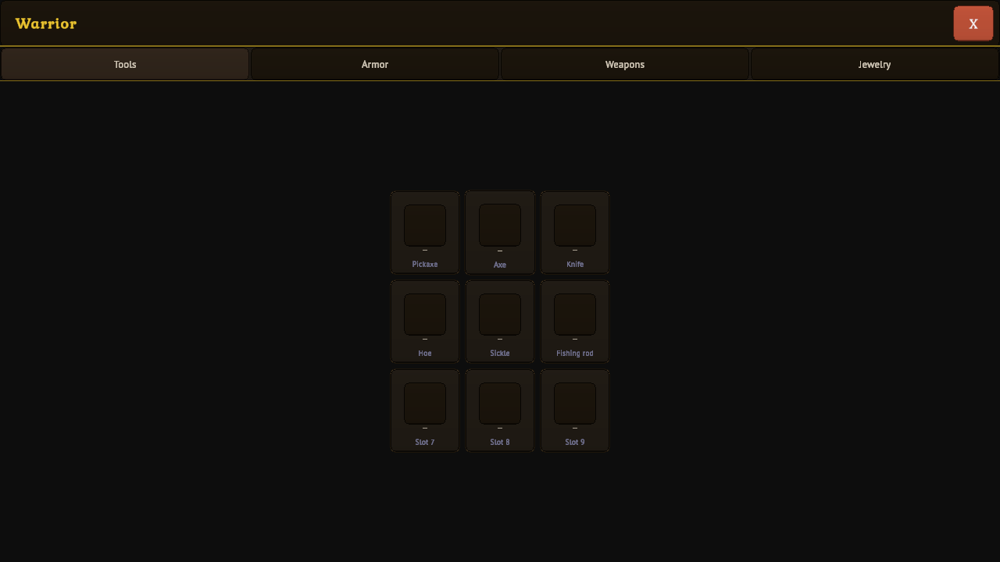
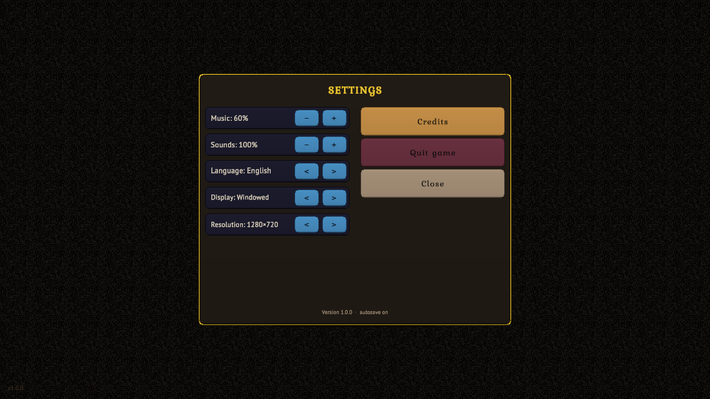

# Emberkin

Emberkin is a completed solo learning project made in Unity. It is a single-player fantasy management game about developing a small settlement and a party of heroes.

## About the game

Manage your heroes, assign work, gather resources, craft equipment, improve the settlement, explore nearby lands, and take part in battles and expeditions.

### Features

- Three starting hero roles: Warrior, Archer, and Mage
- Character attributes, equipment, professions, and personal development
- Settlement construction, resource gathering, and crafting
- World exploration, combat zones, and expeditions
- English, Norwegian, and Russian language options
- Offline progress for selected activities

## Download

- [Download Emberkin for Windows on itch.io](https://johndrochers.itch.io/emberkin)
- [GitHub Releases](https://github.com/johndrochers/emberkin/releases)

Extract the ZIP archive and run Emberkin.exe. Keep the executable and the Emberkin_Data folder together.

## Screenshots

## Development note

This game was developed independently as a learning project using an AI-assisted workflow. My work included defining and iterating on the game design, integrating gameplay systems, testing, debugging, localization, build preparation, and release packaging.

This repository is a portfolio showcase for the released game. The full Unity source project is not distributed here because it contains third-party assets.

## Current version

Version 1.0.0 — Windows 64-bit

Some secondary data-driven names may still appear in Russian. The core interface is available in English.
